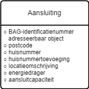

# Informatiemodel voor de gegevensverstrekking warmtetransitie

Grondslag: [Wetsvoorstel Wet gemeenteli6jke instrumenten
warmtetransitie](https://www.tweedekamer.nl/kamerstukken/wetsvoorstellen/detail?cfg=wetsvoorsteldetails&qry=wetsvoorstel%3A36387),
artikel II, onderdeel E:

In afdeling 20.1 wordt een artikel toegevoegd, luidende:

```
Artikel 20.7a (verzamelen en verstrekken vertrouwelijke gegevens)

De op grond van artikel 20.2, zevende lid, of artikel 20.6, eerste lid, te
verzamelen of verstrekken gegevens kunnen voor de verduurzaming van de
energievoorziening van gebouwen betrekking hebben op:

a. de naam en het adres van de eigenaar van een onroerende zaak of de
   gerechtigde tot een appartementsrecht, als dat niet ook de bewoner of
   gebruiker is, volgens de basisregistratie kadaster, en
b. de aansluiting en toekomstige aansluiting van een gebouw op een
   energievoorziening als bedoeld in artikel 10, zesde lid, onder a en b, van
   de Gaswet, artikel 23, eerste lid, van de Elektriciteitswet 1998 of artikel
   1, eerste lid, van de Warmtewet.
```



## Definities
* Aansluiting: recht op het gebruik van één of meer verbindingen tussen een
  energienet en een onroerende zaak
* BAG-identificatienummer adressseerbaar object: unieke aanduiding van een
  verblijfsobject, standplaats of ligplaats zoals geregistreerd in de
  Basisregistratie Adressen en Gebouwen
* postcode: reeks tekens die in een postadres wordt opgenomen om het
  automatisch sorteren van de post gemakkelijker te maken
* huisnummer: aan een adresseerbaar object toegekende nummering
* huisnummertoevoeging: aan een adresseerbaar object toegekende nadere
  toevoeging bij een huisnummer, inclusief huisletter
* locatieomschrijving: omschrijving van de ligging van een aansluitlocatie,
  eventueel ten opzichte van een nabijgelegen adres
* energiedrager: medium dat bruikbare energie bevat (elektriciteit, gas)
* aansluitcapaciteit: transportvermogen van de aansluiting zoals door een
  potentiële aangeslotene is aangevraagd en waarvoor het aansluittarief wordt
  betaald (aangeduid als aantal fasen x ampère, kVA of m3/uur)

## Opmerkingen
* Opvragen met een lijst van BAG-ID's, maar antwoord bevat niet altijd een
  BAG-ID. In dat geval is er gematcht op adresgegevens.
* Alleen BAG-objecten teruggeven (dus geen straatmeubilair).
* eHerkenning?
* autorisatie: verzoeken buiten grenzen van betreffende gemeente afwijzen.
